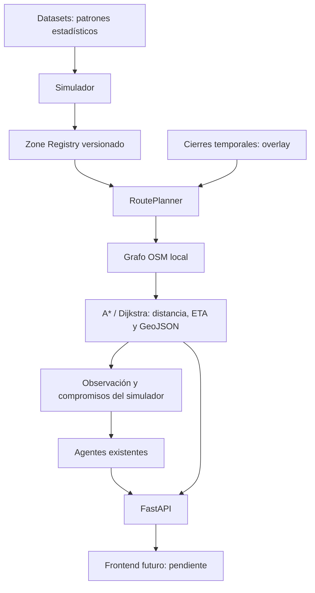

# MVP 3.5 — Geospatial Routing con OpenStreetMap

Se añadió infraestructura geográfica al backend, sin frontend. `SmartAgent`,
`FirstNearbyOrderBaseline`, su threshold, reservation wage, perfiles de vehículos,
historical model, datasets, hard constraints y resultados anteriores no se modificaron.
La verificación local comparó 468 archivos previos fuera de los seis archivos de
integración autorizados; no encontró cambios. No se ejecutó tuning ni held-out.

## Arquitectura y compatibilidad



`StrategicSimulator` conserva el modo `precomputed`: se extrajeron pequeños hooks
para preparar ofertas, cotizar/confirmar secuencias y cotizar reposicionamientos.
`GeospatialSimulator` implementa `osm` mediante esos hooks. El simulador base solo
añade un hook para reemplazar el retraso fijo de cierre por el desvío geográfico.

El generador y sus datos permanecen intactos. En OSM, la capa operativa reemplaza
distancias y tiempos de traslado antes de que el agente reciba una oferta. Conserva
el evento fuente para auditoría; esas distancias históricas/sintéticas no se usan
como distancia ejecutada. Preparación, demanda y pagos mantienen su procedencia.

## Zonas, método y coordenadas

Registro: `config/monterrey_zones.json`. Son doce puntos representativos internos,
seleccionados aproximadamente en sectores centrales de los lugares nombrados,
con referencia al [mapa de OpenStreetMap de Monterrey](https://www.openstreetmap.org/#map=12/25.7040/-100.3200).
No son polígonos oficiales, centroides calculados, zonas de Infosys ni coordenadas
extraídas de Kaggle o Solomon. Las coordenadas redondeadas sirven para definir
una referencia reproducible; el punto operativo es su nodo de acceso vial.

| ID | Nombre | Latitud | Longitud | Ajuste al nodo vial (m) |
|---:|---|---:|---:|---:|
| 1 | Centro / Macroplaza | 25.6692 | -100.3099 | 68.19 |
| 2 | San Pedro Centro | 25.6573 | -100.4023 | 22.05 |
| 3 | Valle Oriente | 25.6475 | -100.3355 | 73.17 |
| 4 | Obispado | 25.6750 | -100.3450 | 167.31 |
| 5 | Mitras Centro | 25.7040 | -100.3500 | 30.00 |
| 6 | Cumbres | 25.7270 | -100.3900 | 109.19 |
| 7 | Tecnológico | 25.6510 | -100.2890 | 167.13 |
| 8 | Contry | 25.6280 | -100.2780 | 43.40 |
| 9 | Guadalupe Centro | 25.6775 | -100.2597 | 6.93 |
| 10 | San Nicolás Centro | 25.7520 | -100.2950 | 50.00 |
| 11 | Apodaca Centro | 25.7810 | -100.1880 | 51.31 |
| 12 | Santa Catarina Centro | 25.6730 | -100.4580 | 91.11 |

El nodo más cercano de todo el grafo no siempre permite llegar y salir. Se usa
`nearest_nodes` sobre el mayor componente fuertemente conectado, conservando el
grafo completo para routing. Todas las zonas pasan una comprobación adicional de
conectividad mutua; se rechazan ajustes mayores de 2 km. El máximo observado es
167.31 m. Esos metros de acceso fuera del grafo no se suman al trayecto vial.
Cambiar un nombre o coordenada cambia el SHA-256 del mapping y exige regenerar
explícitamente el caché. El significado previo de `flagged_zones` se conserva:
asignar el ID 11 a Apodaca no constituye una afirmación sobre su seguridad real.

## Grafo, caché y dependencias

```powershell
.venv\Scripts\python.exe -m pip install -r requirements-lock.txt
.venv\Scripts\python.exe -m scripts.build_osm_graph
```

La primera construcción usa OSMnx `graph_from_bbox`, `network_type="drive"`,
en el rectángulo `(west, south, east, north) = (-100.49, 25.60, -100.14, 25.81)`.
Las siguientes cargas son locales. `--rebuild` reconstruye explícitamente; OSMnx
puede reutilizar sus respuestas HTTP cacheadas. Para una actualización de datos
OSM, usar un nuevo `--cache-dir` y conservar el anterior para reproducibilidad.

Archivos locales excluidos de git:

- `data/osm/monterrey_drive.graphml`: **87,753 nodos, 222,979 aristas dirigidas**,
  **115,975,039 bytes** (aproximadamente 110.60 MiB).
- `data/osm/metadata.json`: área, fecha UTC, tipo de red, versiones, conteos,
  defaults de velocidad y atribución.
- `data/osm/zone_nodes.json`: nodo y distancia de ajuste por zona, ligado a las
  versiones del grafo y registro.
- `data/osm/http_cache/`: respuestas utilizadas durante la construcción.

Grafo verificado: `e0159f35c8aa7375acb02fa09857a4c9070d71881b21fc56d40b929775439c03`.
Fecha de construcción: `2026-09-13T00:48:37.699367+00:00`.
Mapping: `8d6eb7e9e6869b4faa998305ecb0fd307fc144e9fc4293e10fdf826217cbc2ed`.
La carga comprueba SHA-256 del GraphML; no descarga ni sustituye un caché corrupto.

Dependencias directas nuevas: OSMnx, NetworkX y scikit-learn (BallTree requerido
por `nearest_nodes` con latitud/longitud). GeoPandas, Shapely y pyproj llegan con
OSMnx. `requirements-lock.txt` fija también las dependencias transitivas instaladas.
`requirements-dev.txt` ya incluye los requisitos de producción; no necesitó cambios.
OSMnx local: 2.1.1; NetworkX: 3.6.1. `pip check`: correcto.

Fuente técnica: [referencia oficial de OSMnx](https://osmnx.readthedocs.io/en/stable/user-reference.html).
Datos: © OpenStreetMap contributors, [ODbL y atribución](https://www.openstreetmap.org/copyright).
El frontend deberá mostrar esa atribución. No existe dependencia de tiles.

## Rutas y ETA

`RoutePlanner.route(origin_zone=7, destination_zone=11, vehicle="moto")` devuelve
un diccionario serializable con origen/destino, algoritmo, kilómetros, minutos,
`node_path`, aristas `(u,v,key)`, geometría, versiones y hash de ruta.
También hay `route_nodes` y `route_coordinates`, este último con entradas `(lat,lon)`.
La geometría es `LineString` en **[longitud, latitud]**, usando las curvas de las
aristas OSM y orientándolas en el sentido de recorrido. Un origen igual al destino
produce distancia/ETA cero y una línea degenerada de dos posiciones iguales.

Se minimizan minutos de viaje. A* usa distancia de círculo máximo dividida por la
velocidad máxima del perfil, multiplicada por un factor conservador calculado a
partir de las longitudes reales de las aristas. Esto mantiene la heurística
admisible y consistente incluso ante redondeos del grafo. Dijkstra usa exactamente
el mismo costo, se selecciona con `algorithm="dijkstra"` y sirve de alternativa y
verificación. No se promete que optimizar tiempo minimice también distancia en
redes con velocidades distintas. En la demo ambos obtienen la misma ruta y costo.

Se ordenan nodos/aristas al cargar y se desempatan aristas paralelas por costo e
ID. Un cierre bloquea la arista dirigida exacta, no todas las aristas paralelas.
El caché LRU de 2,048 rutas incluye nodos, vehículo, velocidad del perfil,
algoritmo, versión del grafo y conjunto activo de aristas bloqueadas. Devuelve
copias para evitar que un consumidor modifique rutas posteriores. No se agregó
la matriz opcional de zonas: este caché ya cubre las consultas repetidas.

OSMnx obtiene `speed_kph` de `maxspeed` cuando es interpretable y agrega
`travel_time`. Para faltantes se suministran supuestos de modelado, en km/h:
motorway 70, trunk 60, primary 50, secondary 40, tertiary 35, residential 25,
living_street/service 15 y unclassified/fallback 25. **No son límites legales
verificados ni velocidades observadas.** El costo operativo usa
`min(speed_kph de la arista, speed_kmh del perfil existente)`: moto 25, car 20,
bike 15. No se modificaron perfiles ni se ajustaron factores con resultados.

La lluvia reutiliza `rain_travel_time_multiplier` existente (1.25 por defecto).
Se aplica una vez al tiempo OSM y reescala solamente trabajo restante cuando
empieza/termina. No cambia la geometría. No hay un multiplicador operativo de
tráfico separado en el simulador inspeccionado. Surge modifica economía; delay
agrega espera a la orden correspondiente, sin modificar el grafo.

## Cierres y ejecución

El grafo base queda congelado estructuralmente. `ClosureOverlay` guarda intervalos
`[start_time,end_time)` y aristas bloqueadas; nunca elimina vías del grafo base.

- **Road:** coincidencia exacta normalizada (mayúsculas, acentos, `Av.`/`Avenida`)
  contra nombres OSM, incluyendo listas de nombres. Nombre no encontrado: error
  explícito; no se transforma silenciosamente en cierre global.
- **Edges:** lista explícita de `(u,v,key)`; un sentido no implica el contrario.
- **Zone:** solamente la primera arista entrante al nodo de acceso según orden
  `(u,v,key)`. Es una perturbación reproducible de acceso, no una zona bloqueada.
- **Transition:** solo las aristas directamente conectadas entre los dos nodos
  de zonas. Si no existe conexión directa se rechaza; no se cierra arbitrariamente
  todo un corredor. Para un corredor se deben especificar sus aristas o nombre.

En streams oficiales se conserva `road` como texto. La extensión
`road="edge:1060798441:1060797865:0"` permite identificar una arista sin modificar
el schema. No hay nuevos tipos de evento oficiales.

El adaptador conserva el orden seleccionado por la inserción existente y calcula
cada segmento sobre OSM. Revalida sus deadlines y las mismas hard constraints
antes de aceptar. No busca otra permutación si la secuencia propuesta resulta
inviable geográficamente; puede rechazar una oferta que otro orden haría viable.
La adaptación no agrega un solver ni cambia la selección original del Smart.
**OR-Tools deferred.**

El courier conserva `current_zone` y `current_node`, este último como último nodo
alcanzado. Internamente consume distancia y tiempo por arista, sin animación ni
interpolación continua de coordenadas. Si un cierre ocurre mientras el courier
ya ocupa una arista, se permite terminar el tramo ocupado hasta su nodo de salida;
se prohíbe entrar de nuevo a aristas cerradas. Ese tramo aparece explícitamente
como `occupied_edge_exit`. La geometría de ese fragmento conserva la arista completa,
aunque distancia/tiempo pendientes representen solo su parte restante.

Los cierres recalculan compromisos activos y guardan distancia, ETA y geometría
anterior/nueva, detour, algoritmo, versiones y hash en el trace. Se conservan costos
ya incurridos. El cierre sustituye el retraso sintético fijo; no lo duplica. Al
expirar, las consultas recuperan rutas base y el courier recalcula desde su posición
actual, que puede ser distinta del origen inicial. Si no existe una ruta, se pausa
la ejecución hasta que cambie la conectividad; una oferta inalcanzable se registra
como SKIP de infraestructura con binding null. El estado `route_unreachable`
identifica que la estimación previa del compromiso no es una ruta factible actual.

Los reposicionamientos conservan su objetivo estratégico original; se recotizan
distancia, tiempo y costo reales antes de ejecutarlos. El mismo guard de seguridad
se reutiliza ante desvíos. La reacción a lluvia mantiene la interrupción de
reposicionamiento que ya tenía el simulador. No hay optimización nueva de destinos.

## API y datos para el mapa futuro

```powershell
.venv\Scripts\python.exe -m uvicorn app.main:app --host 127.0.0.1 --port 8000
```

| Método | Endpoint | Resultado |
|---|---|---|
| GET | `/geospatial/zones` | FeatureCollection de puntos |
| GET | `/geospatial/graph/status` | Disponibilidad local y metadata |
| POST | `/routing/route` | Ruta, distancia, ETA y GeoJSON |
| POST | `/routing/compare` | Resultado A* y Dijkstra |
| POST | `/routing/closures` | Crear cierre en el worker de routing |
| GET | `/routing/closures?sim_time=...` | MultiLineString y estado temporal de cierres |
| GET | `/simulation/{id}/routes` | Rutas y métricas de una demo guardada |
| GET | `/simulation/{id}/agents/{agent}/route` | Trace geográfico de ese agente |

Request de ruta:

```json
{"origin_zone":7,"destination_zone":11,"vehicle":"moto","algorithm":"astar","sim_time":"2026-03-21T18:00:00","rain_factor":1}
```

Request de cierre:

```json
{"closure_id":"CL-001","sim_time":"2026-03-21T18:00:00","duration_min":10,"edges":[[1060798441,1060797865,0]]}
```

Las consultas deben especificar el tiempo simulado para consultar cierres. Si se
omite, se usa `2000-01-01T00:00:00`, no el reloj real. Los timestamps con offset
se normalizan a UTC; los timestamps sin offset se interpretan en el mismo reloj
simulado. No mezclar ambas convenciones en una demo.

El routing corre en un proceso separado, con una sola cola/propietario del overlay;
la carga inicial también ocurre allí. `/decide` no importa/carga OSM ni enruta.
Caché ausente: HTTP 503 con instrucción de construcción; entradas/rutas inválidas:
422. No hay descargas desde endpoints. El caché vive durante el proceso: reiniciar
el servicio reinicia sus cierres. Con varios workers de Uvicorn los overlays son
independientes; usar un worker para esta demo.

No había un registro de simulaciones por ID. Los endpoints nuevos leen artefactos
guardados en `artifacts/geospatial/runs/{id}`; son snapshots, no un simulador live.
Los cierres creados por API no cambian retroactivamente una simulación guardada.
El frontend futuro puede dibujar `geometry`, puntos y cierres, y recorrer los traces
por `sim_time`; cada agente publica su nombre completo como clave.

## Comandos de demo y verificación

```powershell
.venv\Scripts\python.exe -m scripts.test_route --origin-zone 7 --destination-zone 11 --block-used-edge --offline
.venv\Scripts\python.exe -m scripts.test_route --origin-zone 7 --destination-zone 11 --block-road "Nombre exacto presente en OSM"
.venv\Scripts\python.exe -m scripts.run_geospatial_shift --routing osm --seed 202635 --shift-hours 4
.venv\Scripts\python.exe -m scripts.run_geospatial_shift --routing precomputed --seed 202635 --shift-hours 4
.venv\Scripts\python.exe -m scripts.verify_geospatial
.venv\Scripts\python.exe -m pytest -q
```

La segunda línea es una plantilla: sustituir el nombre por uno presente en el
grafo. `--block-used-edge` selecciona determinísticamente una arista usada con
desvío disponible. Guarda `artifacts/geospatial/osm_route_preview.geojson` y
`route_benchmark.json`. `--offline` bloquea conexiones de sockets durante carga y
routing: pasó con el caché real. Los tests también bloquean red al cargar GraphML.

`run_geospatial_shift` reutiliza `artifacts/final_strategy_config.json` si existe;
`--frozen RUTA` exige un archivo existente y verifica sus hashes. **Ese artefacto
no está presente en este checkout.** La demo ejecutada usó los defaults existentes
y modelo vacío, con procedencia explícita, sin recrear calibración. El threshold
FirstNearby sí se leyó de `config/first_nearby_baseline.json`, sin modificarlo:
14.990869288322063 km. Los resultados son smoke tests de infraestructura, no una
nueva evaluación del MVP 3 calibrado. El script rechaza sobrescribir un ID de demo
existente: elegir otra seed para una corrida adicional.

Los logs geográficos usan el schema oficial y traces `.routing.jsonl` separados.
No deben reproducirse con el replay sintético anterior: necesitan el mismo grafo,
mapping y fuente. Los tests comprueban reproducción determinista completa bajo
lluvia/cierre, ignorando solamente latencia medida.

## Evidencia local

Windows, Python 3.13; resultados medidos en esta máquina, no garantías de SLA:

| Medición | Resultado |
|---|---:|
| Carga fría de GraphML + inicialización de planner | 7,949.44 ms |
| A* sin caché de ruta, grafo cargado | 43.57 ms |
| Dijkstra sin caché de ruta, grafo cargado | 862.44 ms |
| Consulta de ruta cacheada | 1.63 ms |
| Reroute después del cierre | 51.90 ms |
| `/decide` concurrente con Dijkstra, mediana de 30 round trips | 1.59 ms |
| `/decide` concurrente, máximo de esos 30 round trips | 2.50 ms |

Ruta moto **7 → 11**: 134 nodos, **20.352712 km**, **48.846509 min**.
Arista cerrada: `(1060798441,1060797865,0)`.
Desvío: **20.524741 km**, **49.259378 min**.
Diferencia: **+0.172029 km**, **+0.412870 min** (aproximadamente 24.77 segundos).
La expiración recupera exactamente el node path original. A* y Dijkstra coinciden.

Turno OSM `osm-seed-202635`, cuatro horas, ambos agentes sobre el mismo stream:
58 ofertas por agente; FirstNearby completó 6, Smart 5; ambos con cero entregas
tardías, cero pedidos incompletos y cero violaciones de seguridad. No interpretar
los ingresos de este smoke como comparación calibrada de políticas.

**330 tests pasan: 296 de regresión y 34 nuevos.** Incluyen zonas, snapping,
multiaristas, A*/Dijkstra, geometría, lluvia/expiración, cierres superpuestos,
inaccesibilidad y recuperación, distancias/costos con velocidades heterogéneas,
multiorden/delay, determinismo, caché offline/corrupto y API. Dos advertencias
preexistentes de deprecación Starlette/TestClient. Dos JSONL de la demo validaron
con `validate_format.py`; API de rutas guardadas respondió 200. Evidencia adicional
en `artifacts/geospatial/verification.json`.

## Archivos entregados y límites

Nuevos: `app/geospatial/{__init__,zones,graph,routing,closures,geometry,cache,
simulation,service,api}.py`, `config/monterrey_zones.json`,
`scripts/{build_osm_graph,test_route,run_geospatial_shift,verify_geospatial}.py`,
`tests/test_geospatial.py` y este documento.

Modificados: `.gitignore`, `requirements.txt`, `requirements-lock.txt`,
`app/main.py`, `app/simulation/simulator.py`, `app/simulation/strategic.py`.
No se modificaron los archivos oficiales del reto ni los resultados de evaluación.

Límites: bike comparte grafo `drive`, por lo que **no es un navegador ciclista ni
garantiza acceso legal para bicicletas**. No se modelan giros restringidos mediante
relaciones OSM, semáforos, tráfico real, pendientes, reglas de acceso específicas
por vehículo ni estacionamiento. La red está recortada al bbox; trayectos óptimos
que salgan de él no están disponibles. No hay polygons de zona ni geocoding live.
Los límites/tags OSM y velocidades de perfil dan un ETA de simulación, no una
predicción de tráfico validada. Nuevas descargas pueden producir rutas distintas:
guardar GraphML, metadata y mapping para reproducibilidad. Frontend pendiente.
